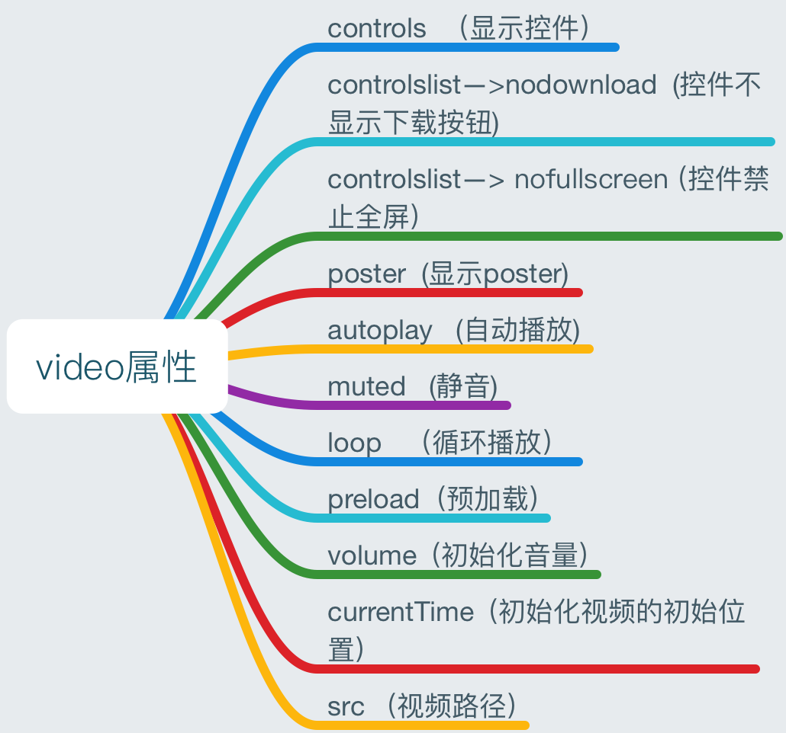
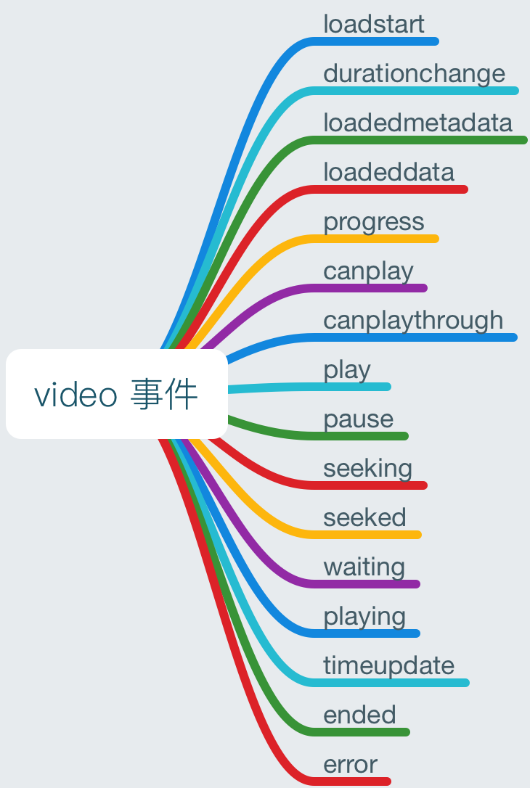

### video 属性的使用

|参数|value|解释|
|----|----|----|
|controls||则向用户显示控件，比如播放按钮|
|controlslist|nodownload|显示控件不显示下载按钮|
|controlslist|nofullscreen|显示控件禁止全屏|
|poster|imgUrl|显示poster|
|autoplay||自动播放|
|muted||静音|
|loop||循环播放|
|preload||预加载|
|以下属性|用js|设置|
|volume|0.5|把初始化视频的音量设置为0.5|
|currentTime|80|把视频初始化到80s的位置|
|src|videoUrl|切换视频|

### video 标签的事件
|参数|解释|
|----|----|
|loadstart|客户端开始请求数据|
|durationchange|资源长度改变|
|loadedmetadata|成功获取资源长度|
|loadeddata|当前帧的数据已加载，但没有足够的数据来播放视频的下一帧|
|progress|客户端正在请求数据|
|canplay|可以播放，但中途可能因为加载而暂停|
|canplaythrough|浏览器预计能够在不停下来进行缓冲的情况下持续播放指定的视频|
|play|点击播放时触发|
|pause|点击暂停时触发|
|seeking|移动/跳跃到新的视频播放位置|
|seeked|移动/跳跃到视频中的新位置|
|waiting|等待数据，并非错误|
|playing|在视频因缓冲而暂停或停止后已就绪时触发|
|timeupdate|播放时间改变|
|ended|播放结束|
|error|播放过程中出现错误|

